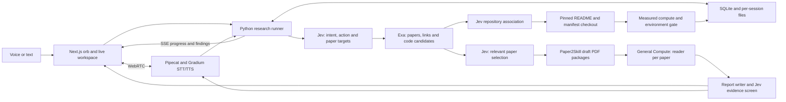

# Research Orb

Open **http://127.0.0.1:3000/** (or `/research`) to ask a research question, watch Jev route it, converse with individual papers and compare their cited findings. The app uses the starter **Next.js + Pipecat + Gradium + General Compute** stack, with **Exa** discovery and actual **Paper2Agent Paper2Skill** PDF preparation. Each conversation has a persistent workspace. Paper agents are separate, evidence-scoped General Compute calls, not impersonations of paper authors.

## Start locally

From `voice-ai-hackathon/practice/`, preserve existing settings in `.env.local` and configure:

| Setting | Purpose |
| --- | --- |
| `TYPESAFE_API_KEY` | Required for Jev routing, paper selection, repository association and report screening. |
| `TYPESAFE_MODEL=jev-latest` | Optional; defaults to `jev-latest`. |
| `EXA_API_KEY` | Publication discovery, public URL extraction and repository search. Saved-paper conversations can reuse existing evidence. |
| `GENERALCOMPUTE_API_KEY` and `GENERALCOMPUTE_MODEL` | Required for paper readers and report generation; use an available model ID. |
| `GENERALCOMPUTE_BASE_URL` | Optional; defaults to `https://api.generalcompute.com/v1`. |
| `GRADIUM_API_KEY` and `GRADIUM_VOICE_ID` | Voice recognition and synthesis. Typed research works without voice. |
| `GRADIUM_REGION=auto` | Optional voice region. |
| `PAPER2AGENT_ROOT` | Optional path to the Paper2Agent checkout; blank uses sibling `Paper2Agent/`. |
| `RESEARCH_WORKSPACE_ROOT` | Optional storage directory; defaults to `pipecat-readiness/.data/research/`. This is a path, not an API key. |

Keys stay on the server. Existing process variables take precedence over `.env.local`, then `.env`. Restart Python after changing configuration or backend code.

```sh
# Once, if dependencies have not been installed:
npm ci
npm run setup:pipecat

# Terminal 1: Next.js on 127.0.0.1:3000
npm run dev

# Terminal 2, also from practice/: Python on 127.0.0.1:7860
npm run dev:pipecat
```

Reuse running processes when appropriate. End an active voice session before restarting Python. The browser's **Start voice** button requests microphone access. This is a local, single-user application; session IDs are not authentication.

## Try the demo

1. Click **New research**. Keep **Search for papers** and **Prepare full paper** enabled; full-paper preparation is enabled by default in the UI.
2. Ask: **“Read Attention Is All You Need https://arxiv.org/abs/1706.03762 and BERT https://arxiv.org/abs/1810.04805. Explain each paper's method.”** General research questions also work; explicit URLs make this rehearsal reproducible.
3. Watch Jev's actual selection, PDF preparation, separate paper-agent streams and the report. **Sources examined** contains only evidence actually read. Open citations to inspect the exact excerpts.
4. Select the **Attention Is All You Need** paper card and ask: **“Explain this paper's attention mechanism and its limitations.”**
5. Clear that selection, select **BERT**, and ask: **“Explain this paper's training objectives and evaluation limitations.”** Saved evidence is reused; follow-up questions do not require another Exa paper search.
6. Select both cards and ask: **“Compare their methods, training objectives and limitations.”** Each reader analyzes its own paper; a coordinator compares both sets of evidence.
7. Expand a paper's repository/compute status to see association, pinned commit when a clone succeeded, measured resources and the reason experiments cannot run. Code discovery does not prevent paper discussion.
8. Refresh to restore this tab's workspace. After a backend restart, saved papers, reports and citation excerpts remain available. Use **Resume a saved conversation** to explicitly open another conversation. **New research** creates an empty session.
9. Start voice and repeat a follow-up. Provisional Jev intent updates accompany the transcript; a committed turn starts the actual run and ends with a short spoken outcome. Physical microphone/headset acceptance remains separate from typed testing.

Cancelled or failed work retains an explicit status. Replaying a saved report does not start another provider call. Clear a paper selection when changing targets; select both cards when requesting an explicit comparison.

## Architecture



Jev returns typed decisions; Python dispatches and cancels work. The conversation actions are `answer_paper`, `compare_papers`, `discover_papers`, `discover_code` and `consider_experiment`, with server-validated paper IDs. The earlier prepared-source Evidence Analyst/Critical Reader path remains available for bundled or pasted material.

Voice previews evaluate the accumulating transcript without launching research. At most one preview request is in flight, with at least 0.5 seconds between starts. The final committed turn receives its own routing decision. The same research context, including selected papers, is used for text and voice.

## Exa and Paper2Agent PDF preparation

Exa supplies publication results, extracted text and bounded link lists. Discovery preserves URL candidates even when Exa returns no readable text. The resolver checks top-level URLs, nested links and URLs in source text, canonicalizes arXiv identities and retains link provenance. A bibliography link is not automatically treated as the parent paper. Jev selects up to two relevant papers; a bounded arXiv-focused fallback search is available when no supported candidate is selected.

Each selected arXiv paper passes independently through the actual sibling `paper_bundle.py` commands:

```text
prepare → extract → review-aid → build --draft → verify
```

Conversion is sequential; the first paper's analysis can stream while the second prepares. Supported arXiv abstract/PDF/HTML URLs resolve to the PDF host. Each PDF is bounded to 20 MB and 60 pages. Timeouts, cancellation and mechanical checks run around real subprocesses. A candidate without Exa text becomes evidence only after preparation produces actual text. If preparation fails, usable Exa excerpts can still be analyzed with honest coverage; empty metadata is not evidence.

The app caches immutable PDF packages, originals and manifests in `pipecat-readiness/.cache/paper2agent/`, outside Git. Follow-ups retrieve question-ranked passages from saved packages. Each paper gets up to 8,000 characters of evidence, with at most two papers analyzed per turn. Session-specific questions and retrieval records live under the conversation workspace, not the shared cache.

**Draft is not reviewed.** The [upstream skill](../../Paper2Agent/skills/paper2agent/paper2skill/SKILL.md) requires “Inspect every page and every supplied image.” The worker leaves review flags unresolved and reports unreviewed coverage. Full acceptance still requires source/page inspection, specific review notes, a fresh verifier, `build --require-reviewed` and `verify --strict`. The report uses selected passages, not every figure or table. Missing selected passages do not prove a method is absent from the complete paper.

## Workspace, memory and citations

SQLite in `pipecat-readiness/.data/research/state.sqlite` stores sessions, raw committed messages, papers, runs, events, findings and job state. WAL transactions serialize writes; inspectable artifacts use atomic file replacement. The whole `.data/` directory is excluded from Git.

```text
.data/research/
  state.sqlite
  sessions/<session-id>/
    summary.md
    runs/<run-id>/report.md
    papers/<paper-id>/
      paper.json
      reports/<run-id>.md
      retrieval/
      jobs/<job-id>/
        job.json
        repo/<repository-name>/
```

The store retains raw history and builds bounded context: up to six recent messages within 6,000 characters, an extractive summary within 3,000 and finding notes within 2,000. Jev receives bounded conversation context for routing. Paper readers and the comparison writer receive recent user questions plus current source evidence; previous generated answers are not fed back as independent evidence. Each paper reader can cite only its own current source. Findings retain draft/verification status and passage identifiers.

Paper identities survive turns. Citation IDs derive from paper identity, version and the exact excerpt; generated passage records also retain chunk IDs. Persisted run snapshots preserve the original cited text even when a later question retrieves different passages. In-memory pruning therefore does not erase saved reports or their citations.

On startup, unfinished runs/jobs become **interrupted**, preserving completed work and partial output without automatically resuming paid operations. Request IDs and event sequence numbers are deduplicated. The tab stores its current session/run in `sessionStorage`; durable history is held by SQLite, not by the tab. New sessions do not automatically load the backend's latest report.

## Repositories and experiment eligibility

The runner looks for public GitHub links in paper evidence and uses a bounded ordinary Exa code search when needed. Jev evaluates association with the exact paper. Results remain labeled `author-linked`, `third-party`, `uncertain` or `not-found`; a search hit alone does not establish authorship. Existing discovery outcomes are reused for ordinary follow-ups.

Associated repositories undergo a bounded shallow clone, pinned to a commit, with README and environment manifests checked out for inspection. Checkout artifacts and job status belong to the session/paper workspace. The application uses argument-list Git subprocesses and does not install dependencies or run repository scripts.

The gate measures the actual local host: CPU/platform, available RAM, free disk, runtimes and available GPU/CUDA information. It compares explicit documented requirements while recording unknown operation-specific requirements. General Compute inference credentials do not provide an experiment machine.

**No isolated experiment worker is registered in this demo, so experiments do not execute.** The UI records `blocked_compute`, `blocked_environment`, `requirements_unknown` or `unsupported_operation` and the specific reason. Repository inspection is not scientific reproduction. Paper2MCP's complete code-generation, execution and independent verification workflow remains unconnected. Next work is a registered isolated executor plus a bounded, verified operation with validated dependencies, inputs and resource limits; a full arbitrary-repository runner is outside this demo.

## Verification and limits

**Current workspace checkpoint — September 19, 2026:** a real two-paper browser journey completed its initial research in **19.563 seconds**, individual follow-ups in **6.455 / 5.904 seconds**, and a comparison in **8.677 seconds**. A backend restart preserved two papers and four runs, including report/event replay. Explicit resume, selecting BERT without another Exa search, and the mobile view passed without browser errors. These are individual observations, not latency guarantees.

A later comparison after the paper-context fix produced **4,891 characters**, with **three of eight passages withheld** by Jev's evidence screen. It remained visibly partial and unreviewed. The screen can remove unsupported text but does not establish scientific correctness or full-paper review.

Final validation passed **163 Python tests, 72 JavaScript tests, TypeScript, production build and HTTP readiness checks**. The browser/source secret scan checked 192 files against eight configured values without printing credentials. See [todo.md](../../todo.md) for observed browser/voice results and remaining acceptance. Storage tests cover restart/isolation, ten-turn bounded memory, immutable citation revisions, duplicate requests/events and interrupted jobs.

Earlier checkpoints separately exercised real 15-page Paper2Skill conversion, cache reuse, Exa voice discovery and synthetic speech through Gradium. The new workspace acceptance above used typed browser input. Physical microphone/headset quality and latency still need user testing; neither synthetic speech nor typed tests establish that acceptance.

```sh
npm test
npm run typecheck
npm run test:pipecat
npm run build

# Readiness only:
curl http://127.0.0.1:3000/api/research/health
curl http://127.0.0.1:3000/api/research/voice/health

# Optional real-provider checks:
npm run smoke:gradium
npm run smoke:research
npm run smoke:research:voice
```

If the app reports an unavailable backend, start or restart `npm run dev:pipecat`. Missing configuration appears by variable name; provider failures preserve the question. Session/PDF runs have a bounded 360-second overall deadline; individual preparation, provider and repository stages have shorter limits. Cancellation stops child work and marks retained output partial.

Remaining limits include strict visual/source review, general publisher PDFs/uploads, arbitrary scientific execution, authenticated multi-user access and a durable independent job queue. Repository discovery may fail or stay uncertain for papers without verifiable code.

## Integration points

Next.js forwards same-origin research routes to the local Python process and streams SSE without buffering. Python owns providers, durable storage, retrieval, job gating and cancellation.

| Browser endpoint | Behavior |
| --- | --- |
| `GET /api/research/health` | Provider/search/Paper2Agent readiness and current run/session identifiers. |
| `GET /api/research/sessions` | Saved conversation summaries for explicit resume. |
| `GET /api/research/sessions/:sessionId` | This conversation's papers, runs, recent messages and job outcomes. |
| `POST /api/research/context` | Save selected sources/papers and session context for the next voice turn. |
| `POST /api/research/runs` | Start a question with `clientRequestId`, `sessionId`, `paperIds`, `sourceIds`, search/preparation flags and optional pasted text. |
| `GET /api/research/runs/:runId/events` | Persisted replay and live SSE; honors `Last-Event-ID`. |
| `POST /api/research/runs/:runId/cancel` | Cancel with a JSON `{}` body. |
| `GET /api/research/runs/:runId/sources/:sourceId` | The exact excerpt read in the cited run, including after restart. |
| `GET /api/research/voice/health` | Combined research and Gradium readiness. |
| `POST/PATCH /api/research/voice/offer` | Small WebRTC signaling. |

Live events include routing, discovery, `paper.selected`, `paper2agent.*`, `paper.agent.*`, `memory.retrieved`, `repo.discovered/cloned`, `compute.checked`, `experiment.blocked`, report screening and terminal run status. Events carry run/session identity and paper/job identity where applicable. Voice provisional intent arrives separately through RTVI `research.intent`; `research.started` announces the committed run. All progress represents actual work boundaries; streamed report drafts may be revised or withheld by the final evidence screen.
